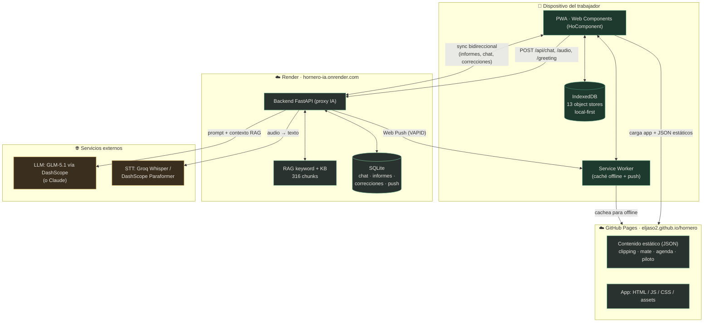
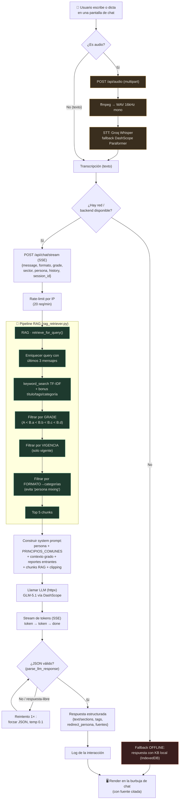
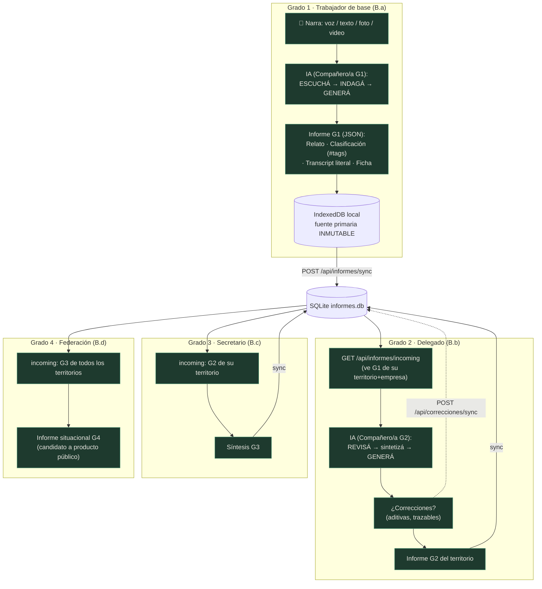

# Hornero — Documentación completa: funcionalidades, arquitectura y aspectos técnicos

> Documento de referencia integral del ecosistema **Hornero**.
> Generado el 2026-08-10 a partir de una auditoría directa del código y la documentación del repositorio `Eljaso2/hornero`.
> Estado del código auditado: PWA desplegada en GitHub Pages (Service Worker **v548**) + backend FastAPI desplegado en Render (`hornero-ia.onrender.com`).

---

## Índice

1. [Qué es Hornero (la utilidad)](#1-qué-es-hornero-la-utilidad)
2. [Filosofía y posicionamiento político](#2-filosofía-y-posicionamiento-político)
3. [Arquitectura conceptual: 3 capas y 15 núcleos](#3-arquitectura-conceptual-3-capas-y-15-núcleos)
4. [Inventario de los 15 núcleos](#4-inventario-de-los-15-núcleos)
5. [Arquitectura técnica general](#5-arquitectura-técnica-general)
   - [5A. Diagramas de flujo de datos y pipelines](#5a-diagramas-de-flujo-de-datos-y-pipelines)
6. [Frontend: la PWA](#6-frontend-la-pwa)
7. [Backend: FastAPI + IA + RAG](#7-backend-fastapi--ia--rag)
8. [El sistema de IA: personas y prompts](#8-el-sistema-de-ia-personas-y-prompts)
9. [RAG y base de conocimiento](#9-rag-y-base-de-conocimiento)
10. [Modelo de datos y sincronización](#10-modelo-de-datos-y-sincronización)
11. [Inteligencia Sindical: el flujo de informes por grados](#11-inteligencia-sindical-el-flujo-de-informes-por-grados)
12. [Deployment e infraestructura](#12-deployment-e-infraestructura)
13. [Seguridad: estado actual y deuda](#13-seguridad-estado-actual-y-deuda)
14. [Modelo de financiamiento](#14-modelo-de-financiamiento)
15. [Estado del proyecto y deuda técnica](#15-estado-del-proyecto-y-deuda-técnica)
16. [Glosario](#16-glosario)

---

## 1. Qué es Hornero (la utilidad)

**Hornero** es una aplicación móvil (PWA) con asistente de inteligencia artificial para **trabajadores y organizaciones sindicales de Argentina**. Su eje no es tecnológico sino político: **soberanía digital y autonomía** — que la clase trabajadora *cree su propia IA con sus propios materiales en su propia infraestructura*, en lugar de consumir productos de Silicon Valley adaptados.

El **piloto** es la **Federación Aceitera** (F.T.C.I.O.D y A.R.A. — aceiteros y desmotadores de algodón), con foco en el norte de Santa Fe (Reconquista) y las empresas Vicentín S.A.I.C. y Desmotadora Guaycurú, bajo el CCT 420/05.

### Problema que resuelve

Hornero le da al trabajador y al sindicato herramientas para:

- **Entender su convenio y sus derechos** en lenguaje claro, con la fuente siempre citada (núcleo *Nuestro Derecho*).
- **Argumentar desde la posición del trabajador** en paritarias, asambleas y conflictos.
- **Producir "inteligencia sindical" desde abajo**: un flujo de informes por grados (trabajador → delegado → secretario → federación) que convierte relatos de terreno en estadística y análisis trazable en una semana.
- **Analizar a la empresa** con las mismas herramientas que usa el capital (balances, tipología de violencia empresarial).
- **Ver su salario en contexto** (mínimo legal vs. valor constitucional vs. canasta; distribución del ingreso; inflación real vs. oficial).
- **Recuperar y usar su historia** como identidad y arsenal argumentativo.

### Distinción fundadora ("no es X → es Y")

| Lo que NO es | Lo que ES |
|---|---|
| Chatbot legal genérico | Herramienta posicionada desde el trabajador |
| App de un sindicato específico | Plataforma que cada sindicato adapta |
| Scraper de PDFs | Convenio vivo, interactivo, contextualizado |
| App de "noticias laborales" | Inteligencia laboral con categorías de campo |
| Startup que extrae datos | Sistema soberano (los datos no se monetizan) |
| Chatbot "neutral" de "ambos lados" | Argumenta desde la posición del trabajador |
| "Consejo legal" que improvisa | Acceso a la ley con fuente, artículo y vigencia |

### Público objetivo (niveles de acceso / *grades*)

- **A** — usuario libre (puede no ser trabajador afiliado).
- **B.a** — afiliado de base (nivel 1).
- **B.b** — delegado (nivel 2).
- **B.c** — secretario / conducción (nivel 3).
- **B.d** — federación (nivel 4, máximo acceso + tendencias agregadas).

El *grade* condiciona qué contenido de la base de conocimiento se recupera, qué informes se ven y qué acciones se habilitan en la UI.

---

## 2. Filosofía y posicionamiento político

Es explícita y coherentemente un **proyecto de clase trabajadora / marxista-sindical argentino**, con andamiaje teórico propio:

- **Tesis Xiong / Tricontinental** (núcleo filosófico): la distinción central es **consumir IA corporativa vs. crear IA propia** — política y epistemológica, no técnica. La organización interviene en los **seis eslabones de la cadena de valor de la IA**: Datos → Arquitectura → Fine-tuning → Infraestructura → Interfaz → Gobernanza.
- **La metáfora del hornero**: el pájaro construye su nido de barro con su propio trabajo en su propio territorio; no usa nidos ajenos. Lema: **"organizar es construir"**. Se eligió "Hornero" por sobre "Compañero" para no excluir ni intimidar a trabajadores reacios al vocabulario sindical.
- **Categorías de Iñigo Carrera / PIMSA**: ejército activo y de reserva (flotante / latente / estancada), superpoblación relativa, pauperización, fracciones de clase — rechazando explícitamente las categorías INDEC/Banco Mundial ("ocupado/desocupado").
- **Marco marxista de valor/precio de la fuerza de trabajo** (Cremonte): la brecha entre el **precio mínimo legal** del salario y su **valor constitucional** (las 9 necesidades de la LCT, Art. 116) se lee como **súper-explotación**.
- **Anti-neutralidad asumida**: la IA "argumenta desde la posición del trabajador" con "sesgo deliberado" como herramienta política, en dos capas — RAG (biblioteca curada) + prompts dirigidos. Es "formación vivida": implícita, se experimenta sin declararse como línea.
- **Protección de datos como principio**: consentimiento explícito, anonimización por defecto, encriptación, acceso por grados, *EXIF stripping* de fotos/videos. El flujo interno siempre está protegido; la apertura del producto final es "decisión política deliberada, no default técnico".

Anclajes concretos: Federación Aceitera, consultora **Mate** (Rosario), CTAA/IEF-CTAA, marcos OIT / UNGP (Business & Human Rights), y la investigación histórica del propio autor (*El encanto del tanino* / La Forestal, Jasinski 2023).

---

## 3. Arquitectura conceptual: 3 capas y 15 núcleos

El ecosistema se organiza en **3 capas** con **15 núcleos** (+ núcleos potenciales sin número):

- **Capa 1 — Gobernanza / fundacional** (el qué, cómo, dónde y protección): N1 Filosofía, N2 Metodología/Laboratorio, N3 Estructura (infraestructura soberana), N4 Protección. Define reglas, taxonomía y protección que todas las capas consumen.
- **Capa 2 — App** (lo que el trabajador ve): N5 App Hornero (PWA). Principio clave: **la App es consumidor, no productor** — local-first en el teléfono, sync con backend soberano.
- **Capa 3 — Producción / backend** (la "planta"): N6–N15, líneas de trabajo que producen datos, procesan información y (a futuro) entrenan modelos. Lo que la app muestra es su output.

**Flujo bidireccional**: la Capa 3 produce (informes, índices, convenios, clipping) → la Capa 2 los presenta; la Capa 2 recibe (observaciones, testimonios, consultas) → la Capa 3 los procesa; la Capa 1 define las reglas → todas las consumen.

---

## 4. Inventario de los 15 núcleos

### Capa 1 — Fundacional

| Núcleo | Nombre | Qué aporta |
|---|---|---|
| **N1** | Filosofía | Posicionamiento y dirección política (tesis Xiong, cadena de valor de IA, distinciones "no es X → es Y"). |
| **N2** | Metodología / Laboratorio | El codiseño + la "cocina central" que mantiene la taxonomía soberana (~9 familias / ~70 etiquetas), el pipeline, el stack y el fine-tuning. |
| **N3** | Estructura | Infraestructura soberana (VPS argentino → servidor propio), encriptación, backup, acceso por grados. |
| **N4** | Protección | Consentimiento, anonimización, encriptación, distinción dato privado / producto público, uso ético (no se monetizan datos). |

### Capa 2 — App

| Núcleo | Nombre | Qué aporta |
|---|---|---|
| **N5** | App Hornero | Interfaz PWA local-first, privacidad por diseño, "siempre con la fuente", multimodal. Acceso tangible y bidireccional a todo el ecosistema. |

### Capa 3 — Contenido / producción

| Núcleo | Nombre | Qué es / valor para el trabajador |
|---|---|---|
| **N6** | **IS — Inteligencia Sindical** | Sistema de informes por grados 1–4 con visibilidad diferenciada por territorio. El trabajador narra (voz/texto/foto/video); la IA etiqueta y extrae datos duros; el informe escala delegado→secretario→federación. Convierte relato de terreno en estadística y análisis trazable en una semana. (En la app: pantalla **Reporte Gremial**.) |
| **N7** | Nuestro Derecho | La posición oficial documentada del sindicato: convenios (convenio vivo interactivo), leyes (LCT 20.744), discursos, resoluciones, jurisprudencia. "Busca, no asesora": cada respuesta con artículo, vigencia y documento original. |
| **N8** | Historia Obrera | Historia/formación/identidad, articulado con historiaobrera.com.ar. Asistente de investigación en archivos, transcripción/anotación, construcción de narrativas. |
| **N9** | Cómo Somos | Datos duros de la clase trabajadora con categorías del campo obrero (Iñigo Carrera): ejército activo/reserva, pauperización, fracciones de clase. Define la taxonomía soberana del sistema. |
| **N10** | Coyuntura laboral | Clipping semanal automatizado + Informe Gremial + Mirador MATE (síntesis mensual). Único núcleo marcado como **operativo (manual)**. |
| **N11** | Comportamiento Empresarial (CE) | Chat de análisis empresarial + índice **ICE** (4 dimensiones: Directa, Condiciones de Trabajo, Estructural, Simbólica). Cruce **ICE×SMVM** (violencia económica salarial). Analiza a la empresa desde la posición del trabajador (marcos OIT/UNGP). |
| **N12** | Tu Historia | Entrevista adaptativa que etiqueta y archiva testimonios; el trabajador controla su historia (privado/anonimizado/público). |
| **N13** | Felicidad del Trabajador (IFT) | Índice de 6 dimensiones (condiciones materiales, tiempo propio, salud, capacidad organizativa, pertenencia, futuro). Contramedida soberana a las "employee satisfaction surveys". |
| **N14** | Acción Sindical | Lo que el sindicato *hace* (vs. N7 que es lo que *protege*): volantes, comunicados, resoluciones, presentaciones judiciales + barra de conflictos abiertos en tiempo real (alimentada por N6). |
| **N15** | SMVM | El Salario Mínimo Vital y Móvil "en contexto": distinción **precio mínimo legal vs. valor constitucional** (las 9 necesidades LCT Art. 116); la brecha = súper-explotación. Comparador de salario, distribución del ingreso, inflación real (Mate) vs. oficial (INDEC). |

**Núcleos potenciales (sin número)**: Servicios y Beneficios, Bolsa de Trabajo (prioritario), Salud Laboral, Formación y Capacitación, Asamblea y Participación — se implementan según demanda del sindicato piloto.

> ⚠️ Consistencia: algunos archivos de núcleo traen numeración residual de renumeraciones anteriores (p. ej. N12 titulado "Núcleo 15"). Los docs incluyen tabla de mapeo. N6 es **Inteligencia Sindical**, no "índice salarial".

---

## 5. Arquitectura técnica general

```
┌─────────────────────────────────────────────────────────────┐
│  FRONTEND (PWA)  ·  GitHub Pages  ·  eljaso2.github.io/hornero │
│  Web Components nativos (HoComponent, sin build) + IndexedDB   │
│  Service Worker (offline-first) + Web Push                     │
└───────────────┬───────────────────────────────┬──────────────┘
                │ JSON estáticos (data/)          │ /api/*  (fetch)
                │ clipping, mate, agenda, piloto  │
                ▼                                 ▼
        (contenido servido                ┌──────────────────────┐
         desde el propio                  │  BACKEND  ·  Render    │
         GitHub Pages)                    │  FastAPI (proxy IA)    │
                                          │  hornero-ia.onrender.com│
                                          └───────┬───────┬────────┘
                                                  │       │
                       RAG keyword + KB (316 chunks)      │ SQLite
                                                  │       │ (chat, informes,
                                                  ▼       │  correcciones, push)
                                    ┌─────────────────────┐
                                    │  LLM externo          │
                                    │  GLM-5.1 vía DashScope │
                                    │  (Alibaba) / Claude    │
                                    │  + STT: Groq Whisper /  │
                                    │    DashScope Paraformer │
                                    └─────────────────────┘
```

**Puntos clave de la arquitectura real (vs. la aspiracional):**

- El frontend es **offline-first**: casi todo el contenido (clipping, InfoMate, agenda, estructura del piloto) son **JSON estáticos** servidos desde GitHub Pages y cacheados en IndexedDB. El backend se usa **solo** para IA, sincronización de informes/chat entre usuarios, y push.
- El backend es un **proxy FastAPI** delgado: no aloja el LLM, lo llama por HTTP. En producción el LLM es **GLM-5.1 servido por DashScope (Alibaba)** a través del adaptador llamado "deepseek" (el nombre es engañoso).
- La **soberanía de datos** está lograda (taxonomía y corpus propios); la **soberanía de modelo e infraestructura todavía no** (corre en Render, cloud comercial, con un LLM externo) — es la meta explícita de las fases futuras.

---

## 5A. Diagramas de flujo de datos y pipelines

> Los diagramas usan sintaxis **Mermaid** (se renderizan automáticamente en GitHub / GitHub Pages). Debajo de cada uno hay una lectura en texto por si se ve el código crudo.

### 5A.1 Flujo de datos general del sistema

Cómo se mueven los datos entre el trabajador, la PWA (local-first), el contenido estático, el backend, el LLM externo y el almacenamiento.



**Lectura:** el dispositivo es la fuente de verdad local (IndexedDB). El contenido de lectura (clipping, InfoMate, agenda, estructura del piloto) baja como **JSON estático desde GitHub Pages** y se cachea para offline. El backend en Render se usa solo para **IA**, **sincronización** de informes/chat/correcciones entre usuarios, y **push**. El backend nunca aloja el modelo: delega en **LLM y STT externos**.

---

### 5A.2 Pipeline completo de una consulta al chat (RAG + LLM)

El camino end-to-end de un mensaje del usuario, desde que se escribe/dicta hasta que aparece la respuesta citada. Incluye la rama de audio, la rama offline y el reintento.



**Lectura:** si es voz, primero **ffmpeg + STT** producen la transcripción. Sin red, la app responde **offline** con la KB local. Con red, el backend aplica **rate-limit → RAG (5 filtros) → prompt de la persona → LLM en streaming**, valida que la salida sea JSON (con **un reintento** forzando el formato) y la renderiza con la fuente citada.

---

### 5A.3 Pipeline de Inteligencia Sindical (informes por grados)

Cómo un relato de terreno se convierte en inteligencia sindical agregada y trazable, escalando por la jerarquía G1→G4.



**Lectura:** cada grado **solo ve el grado inmediatamente inferior** de su territorio (visibilidad diferenciada por `/api/informes/incoming`). La **fuente primaria del G1 es inmutable**; las **correcciones son aditivas y trazables** (quién, qué, cuándo). Al llegar a la federación (G4), el informe agregado es candidato a **producto público** — decisión política deliberada, no automática.

---

### 5A.4 Ciclo offline-first de sincronización

Por qué la app funciona sin conexión y cómo reconcilia cambios entre dispositivos/usuarios.

```mermaid
sequenceDiagram
    participant U as 👤 Usuario
    participant App as PWA (UI)
    participant IDB as IndexedDB (local)
    participant SW as Service Worker
    participant API as Backend (Render)
    participant DB as SQLite

    U->>App: Crea informe / mensaje
    App->>IDB: Escribe YA (local-first)
    App-->>U: Respuesta inmediata (sin esperar red)
    Note over App,SW: Si NO hay red → queda en syncQueue

    rect rgb(30,58,46)
    Note over App,DB: Cuando hay red (iniciarFullSync)
    App->>API: POST /api/informes/sync (batch)
    API->>DB: UPSERT con guard<br/>WHERE excluded.timestamp > actual
    Note right of DB: last-write-wins por timestamp
    App->>API: GET /api/informes/incoming?grade&territorio
    API->>DB: Consulta según jerarquía
    DB-->>API: Informes visibles
    API-->>App: Devuelve incoming
    App->>IDB: Merge en local
    end

    API->>SW: Web Push (nuevo clipping/informe)
    SW-->>U: Notificación
```



**Lectura:** la escritura es siempre **local primero** (respuesta instantánea); si no hay red, el cambio espera en `syncQueue`. Al reconectar, la sincronización es **bidireccional** con resolución **last-write-wins por `timestamp`**, y la visibilidad de lo que baja respeta la **jerarquía de grados**. El push avisa novedades aunque la app esté cerrada.

---

## 6. Frontend: la PWA

Ubicación: `projects/hornero/app/`. Entry point canónico: **`app-ho.html`** (no `index.html`, que es legacy).

### 6.1 Stack

- **Web Components nativos** vía una clase base propia **`HoComponent extends HTMLElement`** (`lit/ho-component.js`, ~150 líneas, zero-deps). Provee Shadow DOM, propiedades reactivas, re-render en `requestAnimationFrame`, helpers `html`/`css` (concatenación de strings, sin diffing), `emit()` y `goScreen()`.
  - ⚠️ **A pesar del nombre de la carpeta `lit/`, la app NO usa Lit.** El propio código lo aclara: "Native Web Components — no Lit, no npm, no CDN".
- **Sin build step, sin npm, sin bundler.** Los componentes son ES modules importados directamente desde `app-ho.html`.
- **Versionado manual de caché** vía query string `?ver=NNN` en los imports (actualmente `527`) y `CACHE_NAME='hornero-v548'` en el Service Worker. Regla del proyecto (CLAUDE.md): bumpear ambos en cada cambio para forzar refresco en GitHub Pages.
- **Fuentes** (Google Fonts): `Archivo` (títulos/nav), `Public Sans`/`Inter` (cuerpo), `JetBrains Mono` (tags/kickers/datos).

### 6.2 Arquitectura PWA

- **Service Worker** (`service-worker.js`, `hornero-v548`), registrado con `scope:'./'`, `reg.update()` cada 5 min. Estrategias de fetch:
  - HTML (navigate): **network-first** con fallback a caché y a `app-ho.html` offline.
  - JS/CSS/JSON: **network-first** (modo DEV, bypassa el HTTP cache de Chrome).
  - Imágenes: **stale-while-revalidate**. Fuentes/otros: **cache-first**.
  - En `activate`: borra cachés viejas, `clients.claim()`, y avisa `SW_UPDATE_AVAILABLE` → banner de actualización (el usuario decide recargar).
- **Offline / IndexedDB** (`js/db.js`): base `hornero-app` v8 con **13 object stores**: `cargas`, `fuentesPrimarias` (inmutables), `informes`, `correcciones` (aditivas, trazables), `clipping`, `media`, `syncQueue`, `uiState` (reemplaza localStorage), `sectores`, `usuarios`, `convenios`, `chatHistory`, `biblioteca`.
- **Data loader** (`js/data-loader.js`): fetch de JSON en `data/` → cachea en IndexedDB → fallback offline; hace *seeding* versionado de la estructura del piloto.
- **Instalable**: `manifest.json` (`display:standalone`, `portrait`, `theme_color:#1E2321`, iconos 192/512, lema *"El futuro, algo por lo que hay que luchar"*). Banner de instalación custom (`beforeinstallprompt`).
- **Web Push** (`js/push-subscription.js`): VAPID (clave del backend `/api/push/vapid-key`), `pushManager.subscribe`, registro en `/api/push/subscribe`. El SW maneja `push` (notificación de "Nuevo clipping") y `notificationclick` (navega a la pantalla de clipping).
- **Clipping notifier** (`js/clipping-notifier.js`): polling in-app cada 5 min (solo con la pestaña visible) de `clipping-index.json`; si hay edición nueva, prende un badge en el nav "Actualidad".

### 6.3 Navegación y estado

El ruteo vive **enteramente en `<hornero-app>`** (`lit/hornero-app.js`, ~2600 líneas). Los archivos `js/navigation.js` y `js/state.js` son legacy de la versión vanilla previa.

- Estado central: propiedad reactiva `screen`. El shell renderiza el componente activo con un gran `if/else if` sobre `this.screen`.
- Eventos que suben por Shadow DOM (`composed:true`): `screen-change`, `ho-navigate`, `login-success`, `logout-request`, `theme-change`, `profile-updated`.
- `_navigateTo` usa la **History API** (`history.pushState`) → soporta el botón "atrás" del navegador.
- **Bottom nav** de 6 botones: Inicio, Actualidad, Chat, Reporte, Panorama, Perfil. Formación y Archivo se acceden desde el Home.

### 6.4 Inventario de pantallas (componentes `lit/hornero-*.js`)

| Componente | Pantalla | Funcionalidad |
|---|---|---|
| `hornero-app` | Shell / router | Auth gate, navegación, bottom-nav, barra de secciones, popup de Perfil, tema claro/oscuro, banners de update/clipping, sync. |
| `hornero-home` | Inicio | Entrada a las "6 esferas": contenido más nuevo (clipping / InfoMate), fila de íconos de Chat (5 personas), cards de Panorama, Formación y Archivo. |
| `hornero-actualidad` | Actualidad | Contenedor de sub-vistas Clipping / InfoMate / Informe sindical. |
| `hornero-clipping` | Clipping de noticias | Noticias laborales por edición semanal (índice, navegación ←→, calendario, popup con "desarrollo", tags, marca de violencia). |
| `hornero-infomate` | InfoMate | Informe de coyuntura económica (fuente MATE): datos macro (inflación, salario real, empleo) + feed. |
| `hornero-gremial` | **Reporte Gremial** (Compañero/a) | Chat IA para elaborar reportes gremiales con flujo jerárquico y estados; visor de informe; correcciones de superiores; guarda en IndexedDB y sincroniza. |
| `hornero-consulta` | Consulta legal (Abogado/a) | Chat sobre derechos, convenios y legislación laboral; streaming + fallback offline con KB local. |
| `hornero-contenido` | Producción de contenido (Periodista) | Genera podcast, reel, columna, entrevista, prensa. |
| `hornero-formacion` | Historia Obrera / Formación (Historiador/a) | Chat con la Historiadora; efemérides, colección, retazos. |
| `hornero-historiador` | Historiador/a | Chat sobre historia laboral latinoamericana. |
| `hornero-condicion` | Panorama / Condición obrera (Investigador/a) | Condición de la clase trabajadora, índices; sub-secciones Comportamiento Empresarial, SMVM, Felicidad. |
| `hornero-archivo` | Archivo del sindicato | Chat con la Historiadora sobre el archivo/biblioteca. |
| `hornero-is` | Reporte gremial (IS) | Flujo por rol/step; auto-selecciona rol 1–4 según el grade del login. |
| `hornero-ecosistema` | Ecosistema Hornero | Chat donde el personaje "Hornero" explica la IA sindical y la cadena de valor. |
| `hornero-perfil` | Perfil | Datos personales + agremiación; toggle notificaciones y tema; logout. |
| `hornero-login` | Login | Auth client-side contra usuarios piloto. |
| `hornero-chat` | (motor reutilizable) | Burbujas usuario/IA, streaming, typing, sugerencias, copiar/reenviar/like, adjuntar imagen/video, micrófono (Web Speech API), drawer de historial. |
| `hornero-coyuntura` | (legacy/backup) | Versión vieja del clipping; no enlazada en el router actual. |

### 6.5 Login / sesión (cliente)

- **Auth 100% client-side** (`hornero-login.js`): valida usuario+contraseña contra un objeto hardcodeado `PILOT_USERS` (8 usuarios piloto). Cada usuario trae `grade`, `territory`, `sector`, `nombre` y un objeto `agremiacion`.
- **Sesión**: en IndexedDB (`uiState`/`session`) y en localStorage (`hornero-session`) si "Recordarme". El shell restaura la sesión sincrónicamente en el constructor para evitar el flash del login.
- **Logout**: borra la sesión de localStorage y recarga.
- ⚠️ El comentario del código indica que migrará a **JWT** en "Phase 1 real". Hoy no hay auth de servidor.

### 6.6 Sistema de diseño (branding)

- Marca: **Hornero** (el pájaro). Marca paraguas relacionada: **Historia Obrera**. Personajes ilustrados en `assets/personajes/a01–a05.png` (los 5 interlocutores IA).
- Paleta dark (default), tokens `--ho-*`: verdes (`#4E9978`, `#80CCA0`), fondos (`#1E2321`, `#2A3230`), texto (`#E8E6E0`), acento dorado (`#D4A654`), rojo de error/logout (`#A6553E`). Tema claro conmutable desde Perfil.

---

## 7. Backend: FastAPI + IA + RAG

Ubicación: `projects/hornero/backend/`. Es un **proxy FastAPI** (título "Hornero Chat", `version 0.2.0`) que: recibe mensajes de chat, arma un prompt "sindical" con una persona, hace retrieval RAG por keyword, llama a un LLM externo, devuelve JSON estructurado, y sincroniza historial/informes/push en SQLite.

### 7.1 Stack

- **Python 3.11** (`python:3.11-slim`).
- **FastAPI** + **uvicorn**.
- **httpx** (cliente HTTP async para LLM, STT y clipping).
- **python-dotenv**, **python-multipart** (uploads de audio), **pywebpush** (Web Push/VAPID).
- **sqlite3** (stdlib) — tres bases separadas.
- **ffmpeg** (binario del sistema) para convertir audio a WAV 16 kHz mono.
- **PyMuPDF** (`fitz`) solo en el script offline de ingesta (no está en `requirements.txt`).

`requirements.txt` (sin versiones pinneadas): `fastapi`, `uvicorn[standard]`, `httpx`, `python-dotenv`, `python-multipart`, `pywebpush`. **No hay** librería vectorial ni SDK de LLM: todo es HTTP crudo.

### 7.2 Endpoints (≈32, todos bajo `/api`)

CORS permisivo (`allow_origins=["*"]`). Un handler `@app.on_event("startup")` inicializa clipping + chunks.

**Config / salud**
- `GET /api/config` → `{backendUrl, provider}`.
- `GET /api/health` → estado, provider, nº de clipping y chunks, diagnóstico de audio (ffmpeg, claves, modelos STT).

**Chat / IA**
- `POST /api/greeting` — mensaje de apertura de la persona al entrar a una sección (sin RAG).
- `POST /api/chat` — **endpoint principal**: rate-limit por IP, retrieval RAG, system prompt, LLM con reintento, parseo JSON, logging.
- `POST /api/chat/stream` — versión SSE (`token`/`done`/`error`). Streaming real solo con DeepSeek/GLM; con Claude cae a no-stream envuelto en SSE.
- `POST /api/audio` — multipart: transcribe (Groq Whisper → fallback DashScope Paraformer-v2), luego mismo flujo RAG+LLM.
- `POST /api/feedback` — like/dislike; **solo loguea a stdout** (todavía no persiste).

**Base de conocimiento**
- `GET /api/kb` — lista chunks (excerpts), filtrable por `category`/`tipo`.
- `GET /api/kb/{chunk_id}` — chunk completo. ⚠️ Busca solo en los 24 chunks manuales, no en los de PDF (posible bug).
- `GET /api/kb/search?q=` — búsqueda keyword (top 10).
- `POST /api/refresh-clipping` — fuerza refresco del cache.

**Push** — `GET /api/push/vapid-key`, `POST /api/push/subscribe`, `POST /api/push/unsubscribe`, `POST /api/push/notify`, `GET /api/push/stats`.

**Sync de chat** (`chat_history.db`) — `POST /api/chat/sync`, `GET /api/chat/sessions`, `GET /api/chat/messages`, `DELETE /api/chat/session`, `DELETE /api/chat/clear-all` ⚠️, `DELETE /api/chat/clear-user`.

**Sync de informes** (`informes.db`) — `POST /api/informes/sync`, `GET /api/informes/all`, `GET /api/informes/incoming` (visibilidad por jerarquía), `DELETE /api/informes/clear-user`, `DELETE /api/informes/clear-all` ⚠️, `DELETE /api/informes/delete`.

**Correcciones** — `POST /api/correcciones/sync`, `GET /api/correcciones`, `DELETE /api/correcciones/clear-all` ⚠️.

> ⚠️ Los `clear-all` borran **todo para todos los usuarios** sin autenticación (comentados como "one-time cleanup").

### 7.3 Parámetros de generación

- **Temperaturas por formato**: debate 0.4, consulta 0.2, contenido 0.5, reporte 0.2, historia 0.2 (default 0.3); greeting 0.5.
- **max_tokens**: contenido/reporte 3000, resto 2000.
- **Historial**: últimos 30 mensajes.
- **Reintento** (`call_llm_with_retry`): si la respuesta no valida o cae a `respuesta-libre`, reintenta una vez forzando JSON con temperatura 0.1.
- **Parseo** (`parse_llm_response`): JSON puro → bloque markdown → primer `{...}` → fallback a texto plano.

---

## 8. El sistema de IA: personas y prompts

Definidas en `knowledge_base.py`. Hay **7 personas** mapeadas por `formato`/`requested_persona`:

| Persona | Formato/sección | Rol |
|---|---|---|
| `companero` | debate / reporte | **El Compañero/a** — 25 años en planta; acompaña la elaboración de reportes gremiales; comportamiento por grado G1–G4. |
| `abogado` | consulta | **El Abogado Laboralista** — CCT, LCT, SMVM, reforma laboral (default/fallback global). |
| `periodista` | contenido | **El Periodista** — podcast, reel, columna, entrevista. |
| `historiador` | historia | **La Historiadora** — movimiento obrero, La Forestal, efemérides. |
| `sociologo` | panorama | **El Investigador/a de la Clase Obrera** — INDEC/CIFRA/PIMSA, ejército de reserva, SMVM. |
| `hornero` | ecosistema | **Hornero** — la metáfora de la IA sindical; explica el ecosistema y los 6 eslabones. |
| (default) | — | cae a `abogado`. |

Cada persona = bloque `PERSONA_*` + un bloque compartido `PRINCIPIOS_COMUNES` (reglas anti-alucinación, límite de rol/dominio, derivación entre personas vía `redirect_persona`, confidencialidad de reportes, formato de respuesta MODO CHARLA / MODO CONTENIDO / MODO DERIVACIÓN).

Construcción del prompt: `get_system_prompt_rag(formato, chunk_ids, clipping_items, query, requested_persona, grade, incoming_reports, recipient_chain)` = persona + principios comunes + (contexto de grado si es Compañero) + (reportes entrantes si G2+) + (chunks RAG o guía de temas) + (clipping).

**Flujo del reporte del Compañero** (núcleo del producto): G1 (base) = ESCUCHÁ → INDAGÁ → GENERÁ; G2/G3/G4 = REVISÁ reportes entrantes → sintetizá → GENERÁ el reporte del grado. El informe es un JSON con 4 secciones obligatorias: **Relato, Clasificación (etiquetas `#snake_case`), Transcript (literal), Ficha del reportante**, más el tag `reporte-generado`.

**STT (transcripción de audio)** (`transcribe_audio`): convierte a WAV con ffmpeg; primero **Groq Whisper** (`whisper-large-v3`, `es`), fallback **DashScope Paraformer-v2**.

---

## 9. RAG y base de conocimiento

### 9.1 Retriever (`rag_retriever.py`) — sin embeddings

Es **keyword search con TF-IDF en memoria**, pensado para correr en Render sin disco persistente. El propio archivo prevé una futura "Phase 4" con FAISS + embeddings.

Flujo de `retrieve_for_query(query, formato, grade, conversation_history)`:
1. Enriquece la query con los últimos 3 mensajes de usuario.
2. `keyword_search` con scoring TF-IDF (IDF precomputado y cacheado) + bonus por match en título (+3), tags (+2), categoría (+3); stemming manual español y stopwords.
3. Filtra por **grado** (jerarquía `A < B.a < B.b < B.c < B.d`).
4. Filtra por **vigencia** (solo `vigente`).
5. Filtra por **formato → categorías permitidas** (evita "persona mixing").
6. Devuelve top 5.

### 9.2 Base de conocimiento (`kb_data.py` + `kb_chunks.json`)

Dos fuentes fusionadas en `ALL_CHUNKS` (**316 chunks**):

- **24 chunks manuales** (`kb_data.py`): Federación aceitera, Daniel Yofra (Sec. Gral.), Cremonte, empresas Vicentín y Guaycurú, CCT 420/05, paritaria 2026, SMVM, reforma laboral, efemérides obreras. Categorías: efeméride (8), referentes (4), condiciones (3), violencia-empresarial (3), organización (2), convenio/paritaria/smvm/reforma (1 c/u).
- **292 chunks de PDF** (`kb_chunks.json`): todos `tipo=academico`, `category=violencia-empresarial`, de un único libro: *Jasinski, "El encanto del tanino", Prometeo Libros 2023* (historia de La Forestal). Cada chunk trae `book_ref`, `chapter`, `pages`.

Metadata de chunk: `id, tipo, category, tags, title, text, excerpt, sources, quotes[], grade_access, vigencia` (+ `book_ref, chapter, pages`).

### 9.3 Ingesta (`scripts/pdf_to_chunks.py`, offline)

PyMuPDF extrae texto → detecta capítulos por regex → chunking de ~400 palabras cortando en párrafos → autotagging por términos históricos/sindicales → escribe `kb_chunks.json`. CLI: `--bib --tipo --category --id-prefix --tags --grade`.

### 9.4 Clipping (`clipping_cache.py`)

Cache en memoria de noticias sindicales. Fetch desde GitHub Pages (`clipping-index.json` + edición más reciente + `clipping-4.json` semanal), normaliza a esquema común (`titulo, bajada, desarrollo, fuente, fecha, tags, tipo, foto, fuente_url`), auto-refresh cada 60 min, conserva cache previo si falla. Se inyecta al prompt como "NOTICIAS ACTUALES" con regla de citación obligatoria.

---

## 10. Modelo de datos y sincronización

Tres bases SQLite locales al backend (last-write-wins por `timestamp` — `INSERT ... ON CONFLICT DO UPDATE WHERE excluded.timestamp > tabla.timestamp`). En el checkout están vacías/ausentes (schema-only); las tablas se crean/migran on-demand.

- **`chat_history.db`** → tabla `chat_messages`: `id, session_id, username, section, role, persona, text, sections(JSON), tags(JSON), time_str, timestamp, title, redirect_persona, created_at` + `image, source_url` (agregadas en runtime). Índices por username y por (session_id, username).
- **`informes.db`** → dos tablas:
  - `informes`: `id, grado, numero, semana, territorio, estado(pendiente), username, empresa, fecha, timestamp, contenido, sections(JSON), etiquetas(JSON), datosDuros(JSON)` + legacy. Índices por username/grado/estado/territorio/empresa.
  - `correcciones`: `id, informeId, correctorGrado, correctorUsername, fecha, tipo, seccionIndex, seccionTitle, textoOriginal, textoNuevo, resumen, cambios, timestamp, created_at`.
- **`push_subscriptions.db`** → tabla `subscriptions`: `endpoint(PK), keys_auth, keys_p256dh, created_at, updated_at`.

La app es **offline-first**: escribe primero en IndexedDB y sincroniza bidireccionalmente con el backend cuando hay red.

---

## 11. Inteligencia Sindical: el flujo de informes por grados

Es el mecanismo central de "producción de inteligencia desde abajo" (núcleo N6). Los informes fluyen por grados con **visibilidad diferenciada** (`GET /api/informes/incoming`):

- **B.b (delegado, ve grado 1)**: informes G1 (pendiente/visto/aceptado) de su territorio + empresa (matching flexible; sin empresa → todo el territorio).
- **B.c (secretario, ve grado 2)**: G2 de su territorio, todas las empresas.
- **B.d (federación, ve grado 3)**: G3 de todos los territorios.

Los reportes que llegan se inyectan en el prompt del Compañero del grado superior para que los **sintetice** en el informe de su grado. La **fuente primaria es inmutable**; las **correcciones son aditivas y trazables** (quién corrigió qué, cuándo). La confidencialidad se aplica por el filtro de grado/territorio en la capa de datos y, adicionalmente, por instrucciones en el prompt (los reportes solo son visibles para la cadena G1→G2→G3→G4).

---

## 12. Deployment e infraestructura

### Backend — Render (`render.yaml`, target de producción)
- `type: web`, `runtime: python`, `rootDir: projects/hornero/backend`.
- Build: `apt-get install -y ffmpeg && pip install -r requirements.txt`.
- Start: `uvicorn main:app --host 0.0.0.0 --port $PORT`.
- Env vars: `LLM_PROVIDER=deepseek`, `DEEPSEEK_API_KEY` (=key de DashScope, manual), `DEEPSEEK_BASE_URL=https://dashscope.aliyuncs.com/compatible-mode/...`, `DEEPSEEK_MODEL=glm-5.1`, `DASHSCOPE_API_KEY` (STT), `DASHSCOPE_STT_MODEL=paraformer-v2`, `ALLOWED_ORIGIN=https://eljaso2.github.io`, `APP_BACKEND_URL` (auto).
- ⚠️ `render.yaml` no define `GROQ_API_KEY` ni las claves VAPID — hay que setearlas a mano para STT-Groq y push.

### Backend — Docker (dev)
- `Dockerfile`: `python:3.11-slim` + ffmpeg, uvicorn en `:8000`.
- `docker-compose.yml`: build local, `env_file: .env`, uvicorn `--reload`, volumen del cwd.

### Frontend — GitHub Pages
- Repo `Eljaso2/hornero`, servido en `https://eljaso2.github.io/hornero`. Deploy automático en cada push. Cache-busting manual (`?ver=` + `CACHE_NAME`).

### URLs que usa la app
- Producción backend: **`https://hornero-ia.onrender.com`**; dev: **`http://<host>:8000`**.

### Variables de entorno del código
`LLM_PROVIDER`, `DEEPSEEK_API_KEY/BASE_URL/MODEL`, `ANTHROPIC_API_KEY/BASE_URL/MODEL` (default `claude-haiku-4-5-20251001`), `DASHSCOPE_STT_URL/MODEL`, `DASHSCOPE_API_KEY`, `GROQ_API_KEY/STT_URL/STT_MODEL` (default `whisper-large-v3`), `ALLOWED_ORIGIN`, `LOCAL_ORIGIN`, `APP_BACKEND_URL`, `VAPID_PRIVATE_KEY/PUBLIC_KEY/SUBJECT`.

> Nota: el proveedor "deepseek" en producción es en realidad **GLM-5.1 vía DashScope (Alibaba)**. El adaptador `claude.py` también apunta por defecto a DashScope, pero `main.py` lo sobrescribe con las variables `ANTHROPIC_*`.

---

## 13. Seguridad: estado actual y deuda

⚠️ **No hay autenticación ni autorización de servidor.** Puntos concretos:

- El `username` y el `grade` llegan como parámetros del request y se confían ciegamente — cualquiera puede leer/escribir/borrar datos de cualquier usuario conocido.
- Endpoints destructivos globales **sin protección**: `DELETE /api/chat/clear-all`, `/api/informes/clear-all`, `/api/correcciones/clear-all` borran todo para todos.
- CORS en `allow_origins=["*"]` con `allow_credentials=True` (combinación permisiva; el código arma una lista `origins` a partir de `ALLOWED_ORIGIN` pero **no la usa**).
- Único control de abuso: **rate limiting en memoria por IP** (20 req/min) solo en `/api/chat` y `/api/chat/stream`; por proceso, se pierde al reiniciar.
- La jerarquía de grados es control de **UX**, no de seguridad. La confidencialidad de reportes se refuerza por prompt, no solo por permisos de datos.
- Secretos: las API keys vienen de env vars; `.env` está gitignoreado (correcto).

**Pendiente evidente**: auth por usuario (JWT ya previsto en el frontend), proteger/eliminar los `clear-all`, restringir CORS al origen real, mover el rate-limit a un store compartido.

---

## 14. Modelo de financiamiento

Modelo **B2B2C**: las organizaciones sindicales son **clientes**; los trabajadores son **usuarios gratuitos**. Es un "contrato político" — el sindicato entra como co-constructor, no como consumidor.

- **Membresía única** (setup: digitalización de archivos, carga/etiquetado de corpus, configuración, capacitación "Tu sindicato puede crear IA", kit de arranque). Banda por afiliados: <5.000 = 1 salario básico del sector; 5.000–50.000 = 2; >50.000 = 3–4.
- **Servicio mensual** (infraestructura + mantenimiento): Básico ~30.000 ARS, Sectorial ~80–100.000, Completo ~150.000+.
- **Puerta de entrada = federación; implementación = sindicato local** (coincide con el piloto aceitero).
- Accesibilidad: subsidio cruzado, 3–6 meses gratis post-membresía, "modo comunidad", financiamiento externo (Tricontinental, cooperación internacional). Ajuste por índice de salarios, no por dólar.

> Los números son estimadores preliminares; los docs marcan como pendiente calcular el costo real de setup e infraestructura.

---

## 15. Estado del proyecto y deuda técnica

**El código está más avanzado que los documentos de diseño.** Los `.md` describen un plan en 3 fases (piloto → "IA entra" → ecosistema completo), pero el código ya tiene una PWA desplegada y un backend FastAPI sustancial en producción.

**Implementado y activo:**
- PWA en GitHub Pages (SW v548, bumping intensivo → desarrollo iterativo continuo).
- Frontend con Web Components nativos (HoComponent) y ~18 componentes.
- Backend FastAPI real: `main.py` (~1.669 líneas), `knowledge_base.py` (~757), RAG keyword, 316 chunks, múltiples proveedores LLM, SQLite, push — desplegado en Render.
- Commits recientes: multi-usuario con filtrado por username, árbol de clasificación de etiquetas, fix de "persona mixing" en RAG, modo día.

**Aspiracional / no implementado (marcado en los propios docs):**
- **Soberanía de modelo e infraestructura**: hoy corre en Render (cloud comercial) con LLM externo (GLM/DashScope). Soberanía de datos ✓, de modelo ✗, de infraestructura ✗ (el "VPS argentino soberano" es meta futura).
- Taxonomía soberana (~9 familias / ~70 etiquetas): definida en N6 pero marcada como pendiente en otros docs (inconsistencia interna).
- Metodología de ponderación del índice **ICE** (4 dimensiones): aún sin definir.
- Motores de N12, N13, N15: concepto definido, desarrollo pendiente.
- Numeración residual en algunos archivos de núcleo.
- Decisión pendiente: absorber `ecosistema-hornero/` y `hornero-app/` dentro de `hornero/`.

**Deuda técnica de código:**
- Archivos legacy no usados pero aún cacheados por el SW: `index.html`, `js/state.js`, `js/navigation.js`, `assets/service-worker.js`, `hornero-coyuntura.js`.
- Service Worker en "DEV MODE" (network-first forzado); revertir a stale-while-revalidate en producción.
- `GET /api/kb/{chunk_id}` no recupera los chunks de PDF (busca solo en los 24 manuales).
- Sin tests ni CI; dependencias sin versiones pinneadas.
- `POST /api/feedback` no persiste (solo loguea).

**Regla operativa del repo (CLAUDE.md):** tras cada cambio en la app, bumpear `CACHE_NAME` (SW) + `?ver=` en `app-ho.html` y `hornero-components.js`; commitear por paso lógico y push (deploy automático). No restaurar versiones viejas (solo edición incremental).

---

## 16. Glosario

| Sigla / término | Significado |
|---|---|
| **PWA** | Progressive Web App — app web instalable con capacidades offline. |
| **HoComponent** | Clase base propia de Web Components nativos usada por el frontend (reemplaza a Lit). |
| **RAG** | Retrieval-Augmented Generation — recuperación de fragmentos de conocimiento para alimentar al LLM (aquí, keyword + TF-IDF, sin embeddings). |
| **KB / chunk** | Knowledge Base / fragmento indexado del corpus (316 en total). |
| **Persona** | "Personaje" de IA con rol y prompt propios (Compañero, Abogado, Periodista, Historiadora, Investigador, Hornero). |
| **Grade (A / B.a / B.b / B.c / B.d)** | Nivel de acceso: libre / afiliado / delegado / secretario / federación. |
| **IS** | Inteligencia Sindical — el flujo de informes por grados (núcleo N6). |
| **CE / ICE** | Comportamiento Empresarial / Índice de Comportamiento Empresarial (4 dimensiones). |
| **IFT** | Índice de Felicidad del Trabajador (6 dimensiones). |
| **SMVM** | Salario Mínimo Vital y Móvil. |
| **CCT / LCT** | Convenio Colectivo de Trabajo / Ley de Contrato de Trabajo (20.744). |
| **STT** | Speech-to-Text (Groq Whisper / DashScope Paraformer-v2). |
| **VAPID** | Claves para Web Push. |
| **DashScope** | Plataforma de modelos de Alibaba; sirve GLM-5.1 vía adaptador "deepseek". |
| **MATE** | Consultora de economía (Rosario), fuente de InfoMate y datos macro. |
| **F.T.C.I.O.D y A.R.A.** | Federación Aceitera (sindicato del piloto). |

---

*Documento generado por auditoría de código y documentación. Ante cualquier discrepancia entre este resumen y el repositorio, prevalece el código.*
